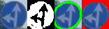
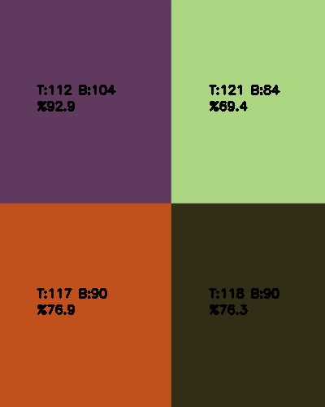
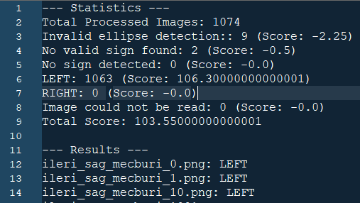

# Trafik İşareti Tanıma Sistemi



**Video akışlarından trafik tabelalarını doğru bir şekilde tespit eden ve sınıflandıran gerçek zamanlı bir sistem. Nesne tespiti için YOLOv8 ve gelişmiş sınıflandırma için OpenCV kullanır.**

## 🚀 Nasıl Çalıştırılır

Projeyi yerel makinenizde çalıştırmak için aşağıdaki adımları izleyin.

### 🛠️ Gereksinimler

*   Python 3.8+
*   [Python Bağımlılıkları Listesi]
    *   `opencv-python >= 4.x`
    *   `numpy >= 1.x`
    *   `tqdm >= 4.x`
    *   `colorama == 0.4.6`
    *   `ultralytics >= 8.x` (YOLOv8 için) # Bunu sadece YoloCutter ile kendi resimlerinizi oluşturmak istiyorsanız kullanın.
### ⚙️ Kurulum

1.  Depoyu klonlayın:
    ```bash
    git clone [https://github.com/itshego/TrafficSignClassifier]
    cd [repository-dizini]
    ```
2.  Gerekli Python paketlerini yükleyin:
    ```bash
    pip install -r requirements.txt
    ```
3.  **[İsteğe Bağlı: Kendi videonuzdan resimler çıkartıp üzerinde çalışmak isterseniz YoloCutter'ı kullanın. Ağırlıklar da klasörün içinde bulunmaktadır]**

### ▶️ Sistemi Çalıştırma

1.  Config.py içinde bulunan DEFAULT_FOLDER_PATH değerinde resim klasörünüzü belirtin. 
Default'u Masaüstü içinde bulunan TSC klasörünün içindeki cropped_images şeklindedir.

2.  TSC.py'yi çalıştırın.

## 💡 Proje Detayları

Bu proje, gerçek zamanlı trafik tabelası tanıma için iki aşamalı bir yaklaşım uygular:

*   **YOLOv8 ile Güçlü Nesne Tespiti:** YOLOv8, video kareleri içindeki trafik tabelalarını etkili bir şekilde tespit etmek için kullanılır.
*   **OpenCV ile Doğru Tabela Sınıflandırması:**  OpenCV tabanlı bir işlem hattı, yalnızca YOLO'ya güvenmenin ilk sınırlamalarının üstesinden gelerek kırpılan tabela görüntülerini sınıflandırmak için kullanılır. Bu işlem hattı şunları içerir:
    *   **HSV Eşikleme:** Görüntü HSV renk uzayına dönüştürülür ve trafik işaretlerinin renklerine karşılık gelen belirli bir ton, doygunluk ve değer aralığındaki pikselleri izole etmek için bir maske oluşturulur.
    *   **Morfolojik İşlemler:** Gürültüyü gidermek ve küçük boşlukları doldurmak için maskeye morfolojik işlemler (kapatma) uygulanır.
    *   **Elips Uydurma: İşlenmiş maskede konturlar algılanır ve en büyük kontura bir elips uydurulur.**
    *   **Elips Boyutu Doğrulama:** Uydurulan elipsin boyutu, hatalı pozitifleri filtrelemek için bir eşiğe (kırpılan görüntünün %80'i) göre doğrulanır.
    *   **Çeyrek Analizi:** Elipsin içindeki bölge dört çeyreğe bölünür ve her çeyrekteki mavi piksellerin yüzdesi hesaplanır. Bu bilgi, işaretin gösterdiği yönü (örneğin, "Sol" veya "Sağ") belirlemek için kullanılır.

*   **Yüksek Doğruluk:** Sistem, 3 farklı videodan alınan 1500'den fazla görüntüden oluşan bir veri kümesinde %99 doğruluk oranına ulaşır.
*   **Elips Tabanlı Yanlış Pozitif Filtreleme:** Yeni bir elips tabanlı filtreleme mekanizması, tanımlanan elipsin tabela şekliyle yakından eşleşmediği tespitleri reddederek yanlış pozitifleri azaltır.

* Proje geliştirme sürecinde farklı parametre ayarlamalarını hızlıca değerlendirmek için basit bir puanlama sistemi kullanılmıştır. Bu sistem, farklı hata türlerine ve doğru tespitlere farklı puanlar vererek, farklı konfigürasyonların göreceli performansını hızlıca karşılaştırmaya yardımcı olmuştur. Kullanıcıların çalıştırması için doğrudan bir anlamı yoktur, ancak geliştirme sürecini hızlandırmak için faydalı olmuştur.

## İsteğe Bağlı Gelişmiş Özellikler

**Gerçek Zamanlı Çalıştırma (İsteğe Bağlı): YoloCutter betiğini kamera girdisiyle çalışacak şekilde modifiye ederek ve OpenCV işlem hattını anlık görüntü işleme moduna geçirerek sistemi gerçek zamanlı olarak çalıştırabilirsiniz. Bu durumda klasör yerine tek dosya işleme moduna geçmeniz gerekecektir.**

**Performans Optimizasyonu (İsteğe Bağlı): OpenCV işlem hattı şu anda CPU üzerinde çalışmaktadır. Performansı daha da artırmak için OpenCV kodunu CUDA kullanarak GPU hızlandırmasıyla çalışacak şekilde güncelleyebilirsiniz. Ancak bu proje öncelikle OpenCV tabanlı sınıflandırma yöntemine odaklandığı için performans optimizasyonu ikinci planda tutulmuştur.**

## 🚧 Karşılaşılan Zorluklar ve Çözümler

Projenin ilk amacı, hem trafik işaretlerini bulmak (nesne tespiti) hem de hangi işaret olduğunu anlamak (sınıflandırma) için YOLO kullanmaktı. Ama YOLO'nun işaretleri tanıma başarımı, özellikle bazı işaretlerde ("İleri veya Sola Mecburi", "Sağa Dön" gibi) yeterince iyi değildi. Bunun sebebi, büyük ihtimalle YOLO'yu eğitirken kullandığımız veri çoğaltma (data augmentation) yöntemindeki, özellikle de döndürme (rotation) ayarlarındaki hatalardı.

Zamanımız kısıtlı olduğu için, farklı bir yol izlemeye karar verdik: YOLO'yu sadece nesne tespiti (işaretlerin yerini bulma) için kullanmaya devam ettik, işaretleri sınıflandırmak içinse bir OpenCV işlem hattı geliştirdim. Başta bu OpenCV hattı da elipsleri doğru tespit edemiyor ve işaretleri yanlış sınıflandırıyordu. Ama HSV renk değerleriyle oynayarak, farklı filtreler deneyerek ve yeni bir elips boyutu kontrolü ekleyerek, OpenCV'nin başarımını epey artırdım ve en sonunda Teknofest Robotaksi yarışma koşullarında %99-100 doğru çalışır hale getirdim.

## 📜 Lisans

Bu proje MIT Lisansı altında lisanslanmıştır.
[https://opensource.org/licenses/MIT](https://opensource.org/licenses/MIT).

## İletişim

hegosder@gmail.com

---
